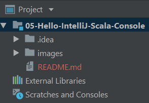
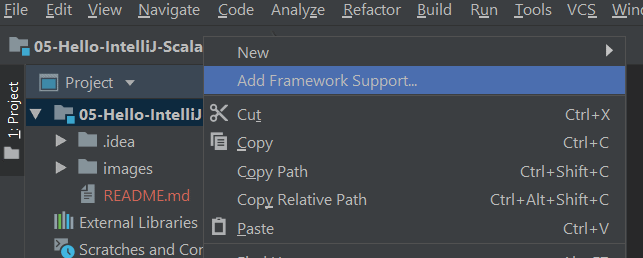
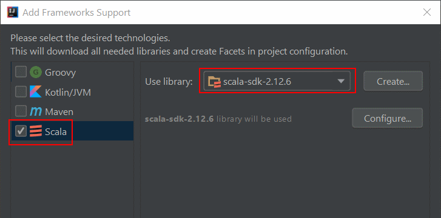
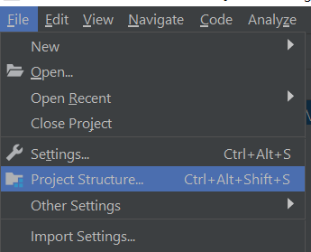
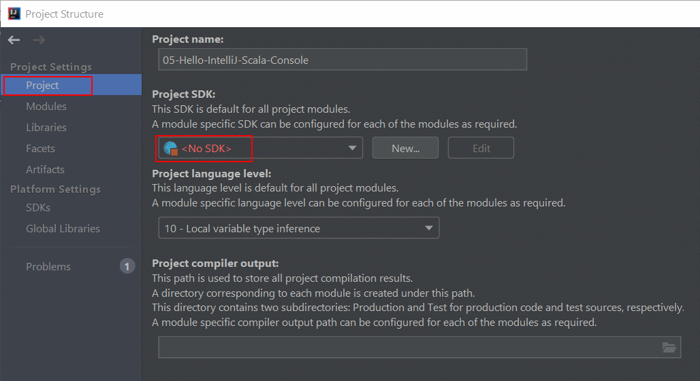
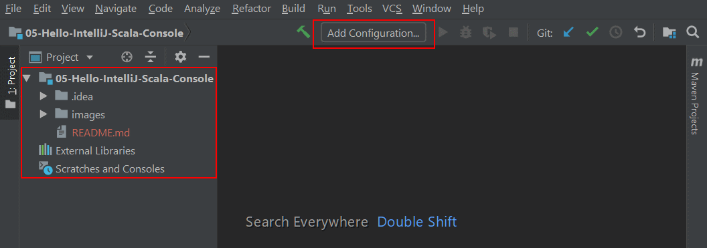
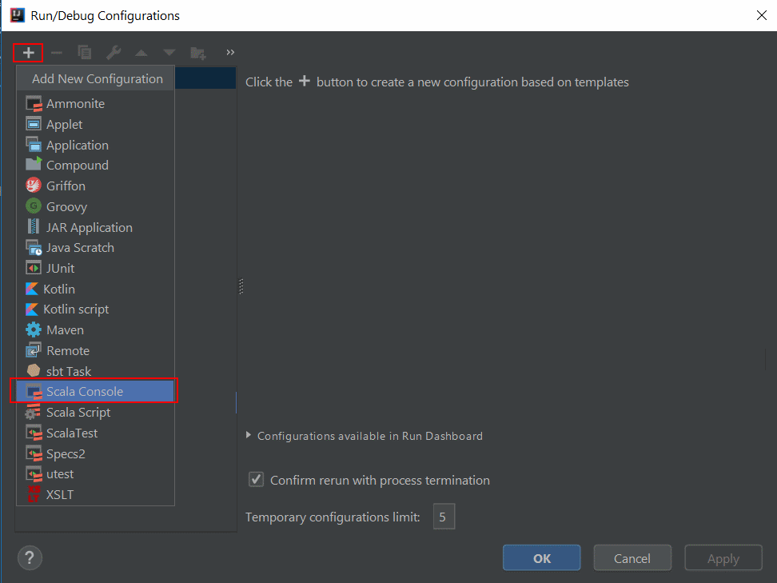
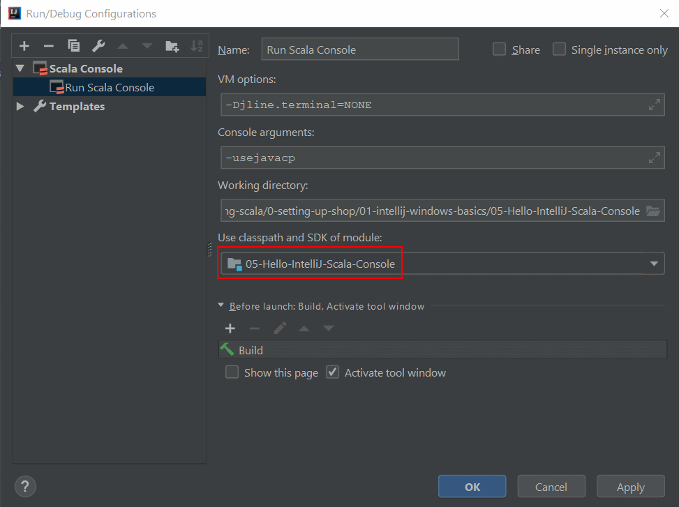
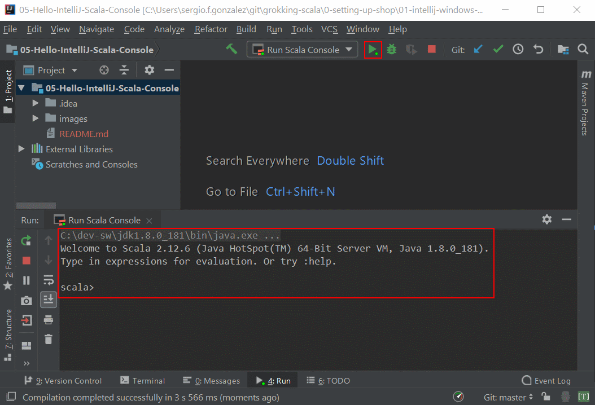

# 05 &mdash; Hello IntelliJ Scala Console  
> knots and bolts of Scala console on IntelliJ IDE

IntelliJ IDE contains a Scala console, but interacting and configuring an empty project, is a little bit different from what you would find using *SBT*.

# Step 1: Open the Project and prepare it for Scala
The first thing is to open the empty project in IntelliJ. 

You will notice that there is no `/src` directory or anything like that, as we want to use it to run the Scala console.

Then, you will have to let know IntelliJ that you want to code some Scala. You can do that by right clicking on the project, selecting `Add Framework Support...`. In the pop-up window, check `Scala`.

Configuration is not over yet! You still have to select `Project Structure...` from the `File` menu and define the JDK for the project:

In the dialog window that is opened, select `Project and then set the Project SDK:

## Step 2: Adding the Scala Console Configuration
Now you're ready to define the Scala Console configuration.
To do that click on `Add Configuration...` button.

Then click on the `+` icon, select `Scala console` and give a name to the new configuration.

Make sure that the *Use classpath and SDK of module* drop-down constains the correct value.

## Step 3: Running code on the Scala console
With all the preparations done, the `Run Scala console` configuration will appear in the toolbar, and you'll be able to start it by clicking on the *play* button close it.

Note that the interaction with this console does not feel as natural as it feels with the *SBT* console, but still, you will be able to run some code.

Remember that you should type `CTRL+Enter` to send a command to the console.