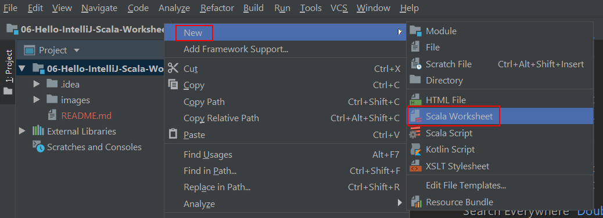
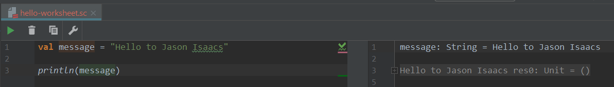

# 06 &mdash; Hello IntelliJ Scala Worksheet  
> Scala worksheet as an alternative to the Scala console in IntelliJ

The *Scala console* inside IntelliJ has a very poor user experience. To work around that problem, IntelliJ lets you create a Scala worksheet that lets you evaluate Scala code on the fly.

Note that this project, has already an `.idea/` directory with the necessary configuration to let IntelliJ know that we are working on a Scala project.

To use a Scala Worksheet, simply right-click on the project and select `New` &raquo; `Scala Worksheet`.

After that, you will be presented with a source code window (with autocomplete, syntax coloring, etc. enabled) on which you will be able to run Scala code interactively.
