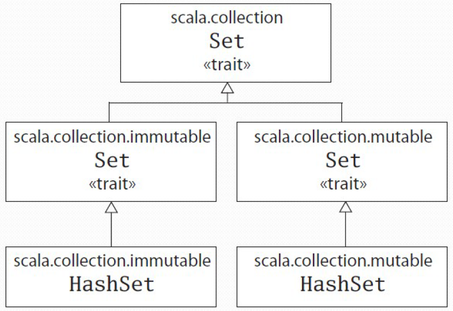
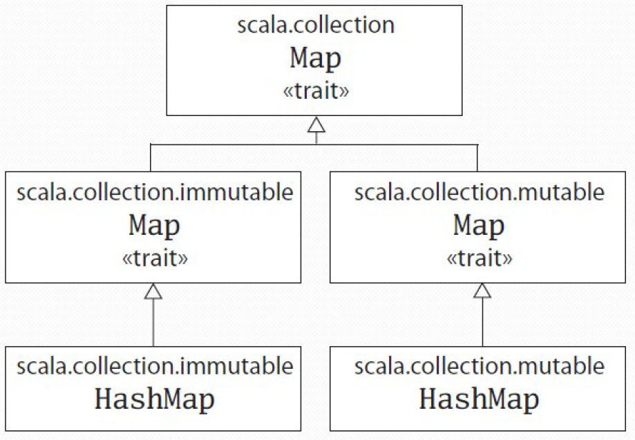

# Part 1 &mdash; Scala Fundamentals &mdash; First Steps in Scala  
> the most basic Scala principles 

## Introduction
This section will introduce Scala quickly will introduce Scala concepts to enable you to start reading and writing programs in Scala. Subsequent sections will tackle all these concepts in a more detailed way.

## Variable Definition
Scala has two kind of variables:
+ `val` &mdash; a variable that once initialized it can never be reassigned throughout its lifetime
+ `var` &mdash; a variable that can be reassigned

The syntax is straightforward:
```scala
scala> val msg = "Hello to Jason Isaacs!"
msg: String = Hello to Jason Isaacs!
```

Note that Scala's type inference mechanism allows you to define the variable without specifying its type, which is correctly identified by the interpreter as `String`.

You can however, specify the variable type using the syntax:
```scala
scala> val msg: String = "Hello to Jeremy Irons"
msg: String = Hello to Jeremy Irons
```

Once defined, you can use the variable name in the expected way:
```scala
scala> println(msg)
Hello to Jason Isaacs
```

| Statements spanning multiple lines |
|------------------------------------|
| You can type statements into the interpreter that spans across multiple lines. The interpreter will respond with a `|` to indicate that you can continue typing:

```
scala> val multiline =
     | "This is the next line"
multiline: String = This is the next line
```

You can escapa from the multiline statement by pressing enter twice:

```scala
scala> val oops =
     |
     |
You typed two blank lines.  Starting a new command.
```
|

## Function definition
Function definitions in Scala use this syntax:

```scala
def fn(param1: Type1, param2: type2, ...): FunctionResultType = {
  // function body here
}
```

Thus:
+ a function definition start with `def`.
+ the function name is followed by a comma-separated list of parameters in parentheses. If the function receives no arguments, you can use `()` to indicate it.
+ function parameter types are not inferred, and therefore should be explicitly given using the syntax `variableName: Type`.
+ after the parameter list, you can give the function result type. This is often optional as Scala will be able to infer it.
+ then, an `=` sign and a pair of curly braces indicate the body function follows.


For example:

```scala
def max(x: Int, y: Int): Int = {
  if (x > y) x
  else y
}
```

Note that no `return` is needed in this case.


The previous syntax can be greatly simplified in most of the cases:
+ the result type of the function will be inferred by Scala in most of the cases
+ if a function consists of a single statement, you can leave off the curly braces

```scala
def max(x: Int, y: Int) = if (x > y) x else y
```

Once defined, a function can be called by its name:

```scala
scala> max(2, 5)
res1: Int = 5
```

A function that returns nothing is said to return a `Unit`. A function returning a `Unit` is invoked to trigger side effects, such as printing a message in the *stdout*:

```scala
scala> def printGreeting() = println("Hello to Jason Isaacs")
printGreeting: ()Unit
```

For an example, see [02 &mdash; Hello Functions!](./02-hello-functions-worksheet).

## `while` and `if`
Scala, being a functional language, features very advanced ways of iterating through collections. However, it also supports *old-school* index based iteration using `while`:

```scala
val args = List("Scala", "is", "fun")
var i = 0
while (i < args.length) {
  if (i != 0)
    print(" ")
  print(args(i))
  i += 1
} // -> Scala is fun
```

For an example, see [03 &mdash; `while` and `if`](./03-while-and-if-worksheet).

## `foreach` and `for`
You can write the previous piece of code in a more concise way using functional programming concepts:

```scala
args.foreach(arg => println(arg))
```

Note that in this case, the you don't even need to make the argument type explicit, but you could do that using the syntax:
```scala
args.foreach((arg: String) => println(arg))
```

But you could even be more concise and use the syntax:

```scala
args.foreach(println)
```

In all these three cases, what we're doing is using functions as *first-class* citizens of Scala, and thus, passing functions as parameters (i.e. `arg => println`) to other functions (i.e. `args.foreach`).

The syntax for a function literal is as follows:
```scala
(arg1: Type1, arg2: Type2 ...) => function_body
```

Scala also defines a functional *for expression* that can be used as follows:

```scala
for (arg <- args)
  println(arg)
```

For an example, see [04 &mdash; `foreach` and `for`](./04-foreach-and-for-worksheet)

## Hello Arrays
In Scala, you parameterize an instance with types by specifying one or more types in square brackets. This is especially needed when working with arrays, as an array requires you to parameterize it with a type and value for the number of elements it can hold.

This is the syntax you use for instantiating a String array with three elements and how to access the individual elements of the array:

```scala
val greetStrings = new Array[String](3)
greetStrings(0) = "Hello"
greetStrings(1) = "to"
greetStrings(2) = "Jason"

for (i <- 0 to 2)
  print(greetStrings(i))
```

Note that:
+ In Scala, you instantiate objects using the `new` operator (e.g. `val bigNumber = new java.math.BigInteger("12345")`)
+ You could have given an explicit type to the array reference using `val greetStrings: Array[String]`
+ The syntax `greetStrings(index)` is used both for reading and writing
+ Note that `val` works as expected: you won't be able to reassign what `greetStrings` is referencing, but you will be able to change the internal state of the array
+ You can use the *for-expression* syntax `for (i <- 0 to 2)` for index-based iteration

| What's happening behind the scenes in `for (i <- 0 to 2)` |
|-----------------------------------------------------------|
| In Scala, if a method takes only one parameter, you can call it without a dot or parentheses. In our example, the `0 to 2` is actually `(0).to(2)`, that is, the argument `0` has a `to` method that is invoked with the argument `2`.

For instance, you could also do `Console println 10` which would be transformed internally to `Console.println(10)`, or `1 + 2` which would result into `(1).+(2)`.
|

Note also that Scala does not have operator overloading, but the fact that it does not require the use of `.` for methods taking one parameter, and that it allows you to name methods with characters like `+` or `!` will make you feel it does.

Another interesting thing is that , when using `greetStrings(2)`, it gets transformed into `greetStrings.apply(2)`, and `greetStrings(1) = "to"` into `greetStrings.update(1, "to")`.

Although useful to explain the concepts, *arrays* can be initialized in a better way using:

```scala
val numNames = Array("zero", "one", "two")
```

The previous snippet uses a factory method named `apply` which creates a new array of length three, with the elements initialized according to the given values.

For an example, see [05 &mdash; Hello Arrays](./05-hello-arrays).

## Hello Lists
Functional programming fosters the use of methods without side effects. Applying this philosophy to the world of objects means making objects immutable.
The *arrays* in Scala are a mutable sequence of objects that share the same type. For an immutable sequence of objects sharing the same type Scala provides the `List` class, and therefore, it is especially suited for *functional programming*.

The following snippet creates two lists and a third one that results from joining the first two.

```scala
val oneTwo = List(1, 2)
val twoThree = List(2, 3)
val oneTwoThreeFour = oneTwo ::: twoThree // -> List(1, 2, 3, 4)
val oneTwoThree = 1 :: twoThree           // -> List(1, 2, 3)
```

As *lists* are immutable, `oneTwoThreeFour` and `oneTwoThree` are completely new lists. 
Note that we have also introduced a couple of convenience methods for lists:
+ the list concatenation operator `:::`
+ the *cons* operator, which prepends an element to a list 

| Methods ending in `:` |
|-----------------------------------------------------------|
| You might be wondering why `1 :: twoThree` works.

In Scala, if a method is used in operator notation, as in `a * b` the method is invoked on the left operand, so it ends up being `a.*(b)`.

However, if the method names ends in a colon, the method is invoked on the right operand, so `1 :: twoThree` is transformed into `twoThree.::(1)`.
|

Scala defines the term `Nil` to identify an empty list. So a convenient way to initialize a list is:

```scala
val oneFourSix = 1 :: 4 :: 6 :: Nil
```

The `List` class also supports and *append* operation, but it is rarely used as it is less efficient than the *cons* operation, so even if you need to build a list appending items, it pays off to use the *cons* operator and then reverse it.

The following table is a `List` cheatsheet:

| Concept                                       | Description |
|-----------------------------------------------|-------------|
| `List()` or `Nil`                             | The empty `List` |
| `List("One", "Two", "Three")`                 | Creates a new `List[String]` with the given values |
| `val list = "One" :: "Two" :: "Three" :: Nil` | Creates a new `List[String]` with the given values using the *cons* operator |
| `List("a", "b") ::: List("c", "d")` | Returns the list that results from concatenating the given lists (returns `List("a", "b", "c", "d")) |
| `list(2)` | Returns the element at index 2 (the third element in the list) |
| `list.count(str => str.length == 4)` | Counts the number of elements in the list satisfying the given predicate |
| `list.drop(2) ` | Returns the list without its first two elements (returns `List("Three")`) |
| `list.dropRight(2)` | Returns the list without its rightmost two elements (returns `List("One)`) |
| `list.exists(str => str == "Three")` | Returns whether an element satisfying the given predicate exists |
| `list.filter(str => str.length == 4)` | Returns a list with the elements satisfying the given predicate |
| `list.forall(str => str.endsWith("e"))` | Returns whether all the elements of the list satisfy the given predicate |
| `list.foreach(str => print(str))`<br>`list.foreach(print)` | Executes the given action for each of the elements. The second option is more concise |
| `list.head` | Returns the first element in the list (returns `"One"`) |
| `list.init` | Returns a list of all but the last element in the list |
| `list.isEmpty` | Returns whether the list is empty |
| `list.last` | Returns the last element in the list (returns `"Three"`) |
| `list.length` | Returns the number of elements in the list (returns `3`) |
| `list.map(str => str + "s")` | Returns a list resulting of appending `"s"` to all the existing elements (returns `List("Ones", "Twos", "Threes"))` |
| `list.mkString(", ")` | Returns a string with all the elements in the list joined by the given string (returns `"One, Two, Three") |
| `list.filterNot(str => str.length == 4)` | Returns a list with all the elements not satisfying the given predicate |
| `list.reverse` | Returns a list containing the elements in reverse order |
| `list.sortWith((s, t) => s.charAt(0).toLower < t.charAt(0).toLower)` | Returns a list containing the elements sorted by the given comparison rule (sorted in alphabetical order by the first character, lowercased) |
| `list.tail` | Returns the list minus the first element (returns `List("Two", "Three"))` |

For an example, see [06 &mdash; Hello Lists](./06-hello-lists). 

## Hello Tuples
The *tuple* is another fundamental, immutable container in Scala that unlike a `List` can contain different types of elements (i.e. a list might be a `List[Int]` or `List[String]`, but a tuple can contain both and integer and a string at the same time).

*Tuples* excel at situations in which you would have to define a *bean* in Java, for instance, when having to return multiple things from a method.

You can create a tuple and access its elements using the following syntax:

```scala
val pair = (99, "Bugs in the code")
println(pair._1)
println(pair._2)
```

For an example, see [07 &mdash; Hello Tuples](./07-hello-tuples)

## Hello Sets
Scala provides mutable and immutable alternatives for sets and maps, but uses the same simple names for both versions.

For example, the Scala API contains a base *trait* for sets, where a trait is similar to a Java interface. Scala then provides two subtraits: one for mutable sets and another for immutable sets.

The following picture illustrates that these three traits share the same simple name, `Set`. Their fully qualified names differ, because each reside in a different package. Concrete set classes, such as the `HashSet` extend either the mutable or immutable `Set` trait. Long story short, as a developer, you will be able to choose between a mutable or immutable implementation of a `HashSet`.


You can create a `Set` in similarly to how you create lists and arrays invoking a factory method. This will return an instance of a default immutable set:

```scala
var jetSet = Set("Boeing", "Airbus")  // -> scala.collection.immutable.Set[String]
jetSet += "Learjet"                   // -> a new Set will be assigned to jetSet
jetSet.contains("Cessna")             // -> false
jetSet = jetSet + "Beechcraft"        // -> same as +=
```

If you want a mutable set, an explicit import is needed:

```scala
import scala.collection.mutable

val movieSet = mutable.Set("Sicario", "Regression")
movieSet += "Detroit" // OK, movieSet is mutable
println(movieSet)
```

As with Java, an `import` statement allows you to use a simple name, such as `Set` instead of the longer, fully qualified name.

The approach is similar if you have to use an explicit implementation like `HashSet`:

```scala
import scala.collection.immutable.HashSet

val hashSet = HashSet("Tomatoes", "Chillies", "Onions")
// hashSet += "Coriander" // Err: It's immutable
println(hashSet + "Coriander")
```
For an example, see [08 &mdash; Hello Sets](./08-hello-sets).

## Hello Maps
As with `Set`, Scala provides mutable and immutable versions of `Map` using a class hierarchy.


As you can see, there's a base `Map` trait in `scala.collection` and two subtraits for the mutable and immutable variants. Below that, you have the concrete implementations you can explicitly select.

Maps are created in the same way as Sets, using a factory method

```scala
import scala.collection.mutable

val treasureMap = mutable.Map[Int, String]()
treasureMap += (1 -> "Go to island")
treasureMap += (2 -> "Find big X on the ground")
treasureMap += (3 -> "Dig, dig and dig")

println(treasureMap(2)) // -> Find big X on the ground
```

Note that once away, Scala transforms `1 -> "Go to island"` into (1).->("Go to island") which returns a two element tuple `(1, "Go to island")`.

Immutable maps are easier to declare, as they require no imports
```scala
val romanNumerals = Map(1 -> "I", 2 -> "II", 3 -> "III", 4 -> "IV")
romanNumerals(3)
```
For an example, see [09 &mdash; Hello Maps](./09-hello-maps)

## Projects

### [01 &mdash; Scala Playground](./01-scala-playground)
An empty project used to start the Scala interpreter from *SBT*.

### [02 &mdash; Hello Functions!](./02-hello-functions-worksheet)
Defining and using functions in Scala

### [03 &mdash; `while` and `if`](./03-while-and-if-worksheet)
Old-school, index-based iteration using `while`.

### [04 &mdash; `foreach` and `for`](./04-foreach-and-for-worksheet)
Introduces the functional iteration Scala supports using `foreach` and the *for expression*.

### [05 &mdash; Hello Arrays](./05-hello-arrays)
Illustrates how to create arrays in Scala.

### [06 &mdash; Hello Lists](./06-hello-lists)
Illustrates how to create and use lists in Scala.

### [07 &mdash; Hello Tuples](./07-hello-tuples)
Illustrates how to create and use tuples in Scala.

### [08 &mdash; Hello Sets](./08-hello-sets)
Illustrates how to create and use Sets in Scala.

### [09 &mdash; Hello Maps](./09-hello-maps)
Illustrates how to create and use Maps in Scala.