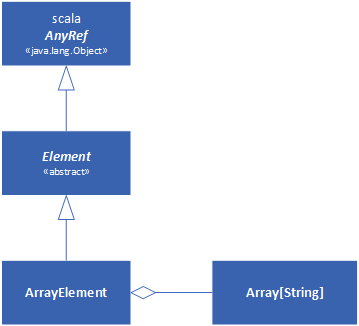
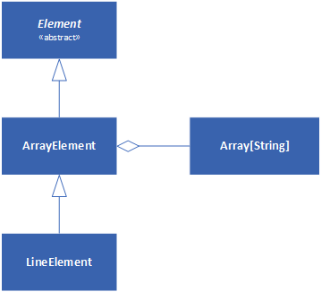
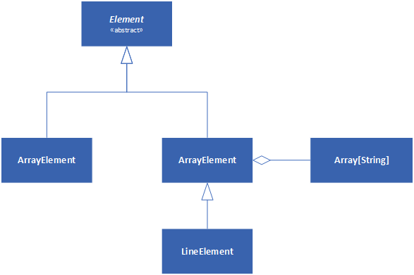
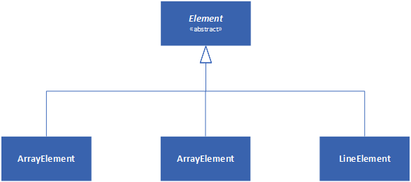

# Part 2 &mdash; Scala In Depth: Composition and Inheritance
> Scala's object-oriented features in depth.

---
+ Abstract classes and abstract methods
+ *Parameterless methods* and *empty-paren methods*
+ Extending classes
+ Overriding Methods and Fields: Scala's two namespaces
+ Parametric Fields
+ Invoking superclass constructor in the subclass definition
+ The rules for `override` modifier in Scala
+ Polymorphism and Dynamic Binding
+ The `final` keyword
+ Composition and Inheritance
+ Defining a *factory object*
+ Hiding classes within classes
---

## Intro
In this section we'll deep dive into the object-oriented aspects of Scala, and in particular composition and inheritance. Composition means that one class holds a reference to another class that is used to help adress its mission. Inheritance is the superclass/subclass relationship.

## Presenting the Use-case: a 2D layout library
As a running example to demonstrate the features, we'll create a library for building and rendering two-dimensional layout elements. Each element will represent a rectangle filled with text. For convenience, the library will provide *factory methods* named `elem` that constructs new elements from passed data.
For example, you'll be able to create a layout element containing a string using a factory method with the following signature:
```scala
elem(s: String): Element
```

Thus, elements will be modeled with a type named `Element`. You'll be able to call `above` or `beside` on an element, passing in a second *element*, to get a new *element* that combines the two.

For example, the following expression would effectively result in a *2x2 table*, built from the specification of its columns:
```scala
var column1 = elem("hello") above elem("xxx")
var column2 = elem("yyy") above elem("world")
column1 beside column2
```

That will print:
```
hello yyy
xxx world
```

We'll define the classes that enable *element objects* to be constructed from arrays, lines and rectangles, that will constitute the basic parts. Those simple parts will be used to be build larger parts with the aid of *composing operators* (also known as *combinators* as they combine existing elements to create new ones).

When dealing with such a system, it's a good practice to apprach the task with answers to the the following questions:
+ Think in terms of *combinators* &mdash; what will be the fundamental ways to construct objects in the application domain?
+ What are the simple parts?
+ How more interesting objects can be built from those simpler ones?
+ How will combinators interact together?
+ What are the most general combinations?
+ Do they satisfy any interesting laws?

## Abstract Classes
The first task is to define the type `Element` which will model the layout elements. Since elements are two dimensional rectangles of characters, it makes sense to include a member `contents` that refers to the cotents of a layout element.
We will represent the contents as an array of strings, where each string in the array will represent a line (i.e. a row).

```scala
abstract class Element {
  def contents: Array[String]
}
```

Note that:
+ `contents` is declared as a method with no implementation &mdash; this is also called an abstract member.
+ the class is declared as `abstract`.

In Scala, a class with *abstract* members must itself be declared as `abstract`. This modifier means the class may have abstract members that do not have implementation. As a result, an abstract class cannot be instantiated:

```scala
new Element // -> Err! class Element is abstract; cannot be instantiated
```

What's the purpose of an abstract class then? They're created as templates that can be be used in *subclasses* of the abstract class and that will fill in the missing definitions for the *abstract* methods.

Note also that in Scala, an abstract method does not need a modifier &mdash; if a method does not have an implementation is automatically abstract.

Another important concepts are declarations and definitions: the `Element` class declares the abstract method `contents`, but defines no concrete methods.

## Defining Parameterless Methods
As a next step, we'll add methods to `Element` that reveal its width (the length of the first line) and height (the number of lines).

```scala
abstract class Element {
  def contents: Array[String]
  def height: Int = contents.length
  def width: Int = if (height == 0) 0 else contents(0).length
}
```

Note that none of the class's methods has a parameter list, not even an empty one. 

Scala differentiates *parameterless methods* (such as `def height: Int`) from *empty-paren methods* (e.g. `def height()`). The convention is to use parameterless methods whenever there are no parameters and the method accesses mutable state only by reading fields of the containing object (i.e. getters). In practice, we could have defined `height` and `width` as *vals* and the client code would have not noticed the differences:

```scala
abstract class Element {
  def contents: Array[String]
  val height = contents.length
  val width = if (height == 0) 0 else contents(0).length
```

Note that a client of class `Element` should not need to be rewritten if a field of a class gets changed into an access function, so long as the access function is pure (i.e. does not have any side effects and does not depend on mutable state)

Scala is very liberal when it comes to let you use *parameterless methods* and *empty-paren methods* using the same syntax, which almost always means dropping the parentheses:
```scala
Array(1, 2, 3).toString
"abc".length
```

However, by convention, it's still recommended to write the empty parentheses when invoking methods that represent something more than a call to a *getter* (i.e. performs I/O, mutates state, etc.):
```scala
println   // Works but not recommended, as it performs some I/O
println() // better
```

## Extending Classes
Now it's time to create *concrete* classes that extend from the abstract class `Element`:
```scala
class ArrayElement(contents: Array[String]) extends Element {
  def contents: Array[String] = contents
}
```

The class `ArrayElement` is said to extend the class `Element`. The class diagram for this simple hierarchy is as follows:


In the picture, we see how `Element` subclasses `AnyRef`, and how `ArrayElement` subclasses `Element`. We also see how `ArrayElement` aggregates an `Array[String]` (composition). `Element` is said to be a superclass of `ArrayElement`, and conversely `ArrayElement` is said to be a *subclass* of `Element`.

The *extends* clause has two effects:
+ It makes `ArrayElement` inherit all non-private members from the `Element` class.
+ It makes `ArrayElement` a subtype of the type `Element`.

Inheritance means that all members of the superclass are also members of the subclass, except if the member is declared *private* in the superclass, or if there is already a member of the subclass with the same name as one in the superclass. In that case, the member in the subclass is said to *override* the member of the superclass. If the superclass's method happens to be an abstract one, we also say that the concrete member *implements* the abstract one.

Thus, in our example:
+ the `contents` method overrides (or alternatively implements) the abstract method `contents` in the `Element` class
+ the methods `width` and `height` are inherited from the `Element` class.

Now, we can start using our concrete class:

```scala
abstract class Element {
  def contents: Array[String]
  def height: Int = contents.length
  def width: Int = if (height == 0) 0 else contents(0).length
}

class ArrayElement(conts: Array[String]) extends Element {
  def contents: Array[String] = conts
}


val ae = new ArrayElement(Array("hello", "world"))
ae.width    // -> 5
ae.height   // -> 2
```

Thus, we can now instantiate `ArrayElement` objects to create elements with several rows.

Note that `ArrayElement` being a subclass of `Element` means that `ArrayElement` instances can be used whenever an `Element` is expected.

```scala
val elem: Element = new ArrayElement(Array("hi"))

elem.width  // -> 2
elem.height // -> 1
```

## Overriding Methods and Fields
The *uniform access principle* that allows clients to see and use both fields and methods in the same manner, is also found in other areas of the Scala language. For example, fields and methods belong to the same namespace. This makes it possible for a field to override a parameterless method.

For instance, you could change the implementation of contents in class `ArrayElement` from a method to a field without changing the definition of the superclass:

```scala
abstract class Element {
  def contents: Array[String]
...
}

class ArrayElement(conts: Array[String]) extends Element {
  val contents: Array[String] = conts
}
```

Because of this principle, you will not be able to have a field and method with the same name in a Scala class.

```scala
class WontCompile {
  val f = 0
  def f = 1 // Err!
}
```

In Scala, there are only two namespaces:
+ values &mdash; fields, methods, packages and singleton objects
+ types &mdash; classes and trait names

## Defining Parametric Fields
The definition of `ArrayElement`:

```scala
class ArrayElement(conts: Array[String]) extends Element {
  val contents: Array[String] = conts
}
```

has a parameter `conts` whose sole purpose is to be copied into the `contents` field. The named had to be chosen to resemble *"contents"* without actually clashing with it. In Scala, this is considered a *code smell* and can be fixed by doing:

```scala
class ArrayElement(val contents: Array[String]) extends Element
```

This is equivalent to:
```scala
class ArrayElement(x123: Array[String]) extends Element {
  val contents: Array[String] = x123
}
```


By prefixing the definition of `contents` with `val` defines at the same time a parameter and field with the same name. This will allow `contents` to be accessed from outside the class and being initialized with the value used when the class is being instantiated.
The class parameter can also be prefixed with `var` to allow the parameter to be reassignable, and you can even use other modifiers such as `private`, `protected` or `override` to these *parametric fields*.

```scala
class Cat {
  val dangerous = false
}

class Tiger(
  override val dangerous: Boolean,
  private var age: Int
) extends Cat
```

which would be equivalent to the following definition:

```scala
class Tiger(param1: Boolean, param2: Int) {
  override val dangerous = param1
  private var age = param2
}
```

## Invoking Superclass Constructors
Now, we will implement other ways to express an element. For example, clients might want to create a layout element consisting of a single line given by a string.

```scala
class LineElement(s: String) extends ArrayElement(Array(s)) {
  override def width = s.length
  override def height = 1
}
```

Note how we pass the necessary argument to the primary constructor of its superclass by placing the argument in parentheses after the extend: `... extends ArrayElement(Array(s))`.

Now, the inheritance hierarchy looks as follows:



## Using Override Modifiers
Note that the definitions of width and height in `LineElement` carry an `override` modifier. This modifier is *required* for all members that override a concrete member in a parent class and *optional* if a member implements an abstract member with the same name.

This *override rules* will make system evolution faster, as you won't be allowed to add new member to a base class if the client code has already introduced such a method.

## Polymorphism and Dynamic Binding
The fact that a variable of type `Element` could refer to an object of type `ArrayElement` is known as *polymorphism*. Up until now, we've seen two forms for `Element`: `ArrayElement` and `LineElement`, and more new forms can be created by definining more subclasses.

For example, we can also define the following form that has a given width and height and and the element gets filles with a given character:

```scala
abstract class Element {
  def contents: Array[String]
  def height: Int = contents.length
  def width: Int = if (height == 0) 0 else contents(0).length
}

class ArrayElement(val contents: Array[String]) extends Element

class LineElement(s: String) extends ArrayElement(Array(s)) {
  override def width: Int = s.length
  override def height = 1
}

class UniformElement(
                      ch: Char,
                      override val width: Int,
                      override val height: Int
                    ) extends Element {
  private val line = ch.toString * width
  def contents = Array.fill(height)(line)
}
```

The inheritance hierarchy for the example now looks as follows:


Thanks to that, Scala will allow all of the following assignments:

```scala
val e1: Element = new ArrayElement(Array("hello", "world"))
val ae: ArrayElement = new LineElement("hello")
val e2: Element = ae
val e3: Element = new UniformElement('x', 2, 3)
```

This will also allow for method invocations on variables and expressions to be *dynamically bound*. This means that the actual method implementation invoked will be determined at run-time based on the actual class of the object, not the type of the variable or expression to which it is assigned to.

To demonstrate this, we can add a method named `demo` to our class hierarchy:

```scala
abstract class Element {
  def contents: Array[String]
  def height: Int = contents.length
  def width: Int = if (height == 0) 0 else contents(0).length

  def demo() = println("Element.demo()")
}

class ArrayElement(val contents: Array[String]) extends Element {
  override def demo() = println("ArrayElement.demo()")
}

class LineElement(s: String) extends ArrayElement(Array(s)) {
  override def width: Int = s.length
  override def height = 1

  override def demo() = println("LineElement.demo()")
}

class UniformElement(
                      ch: Char,
                      override val width: Int,
                      override val height: Int
                    ) extends Element {
  private val line = ch.toString * width
  def contents = Array.fill(height)(line)
}

def invokeDemo(e: Element) = e.demo()
```

Note that `demo` has been defined for `Element`, `ArrayElement`, `LineElement` but not for `UniformElement`.
```scala
invokeDemo(new ArrayElement(Array("something")))  // -> ArrayElement.demo()
invokeDemo(new LineElement("something"))          // -> LineElement.demo()
invokeDemo(new UniformElement(('s'), 5, 2))       // -> Element.demo()
```

Note how the appropriate method is called even when the type of the argument is `Element`. 

## Declaring Final Members
Sometimes, when designing an inheritance hierarchy, you want to ensure that a member cannot be overridden by subclasses. You can do that by adding a `final` modifier to the member.

```scala
class ArrayElement extends Element {
  final override def demo() = println("ArrayElement.demo()")
}
```

When using `final`, any attempt to override this method by any of the subclasses will end up in a compilation error:
```scala
class LineElement(s: String) extends ArrayElement(Array(s)) {
  override def width: Int = s.length
  override def height = 1

  override def demo() = println("LineElement.demo()") // Err: cannot override final member
}
```

The `final` modifier can also be applied to a class that you don't want to be subclassed:

```scala
final class ArrayElement extends Element {
}
class LineElement(s: String) extends ArrayElement(Array(s)) { // Err: illegal inheritance from final class
}
```

## Using Composition and Inheritance
*Composition* and *inheritance* are two ways to define a new class in terms of an existing one. If what you're after is primarily code reuse, you should prefer *composition* to *inheritance*.

*Inheritance* should be used when a *is-a* relationship is found between a superclass and a subclass. Also, it must be clear that your clients will want to use the subclass type as a superclass type to leverage polymorphism and dynamic binding. For example, in our class hierarchy it is clear that:
+ An `ArrayElement` is an `Element`
+ There will be functions receiving `Element` arguments that will want to leverage polymorphism and dynamic binding so that the overriden method of the subclasses get called instead of the `Element` methods when appropriate.

However, these questions will render a suspicious for the `LineElement` class:
+ The `LineElement` is not an `ArrayElement` &mdash; we're inheriting from `LineElement` for convenience and code reuse purposes.
+ It's not clear that we would want to use `LineElement` instances as `ArrayElement`s

Therefore, it really looks like making `LineElement` a subclass of `ArrayElement` is a bad design decision, and we would need to make `LineElement` to inherit from `Element`:

```scala
class LineElement(s: String) extends Element {
  val contents = Array(s)
  override def width = s.length
  override def height = 1
}
```

So that our class hiearchy ends up being:



## Implementing `above`, `beside` and `toString`
As the next step, we'll implement `above` in the base class `Element`. The method will put the left hand element on top of the right hand one.

The first attempt could look something like

```scala
abstract class Element {
...
  def above(that: Element): Element = new ArrayElement(this.contents ++ that.contents)
}
```

Note that the `++` operation concatenates two arrays. 

However, the previous implementation is not robust enough, as it does not let you put elements of different widths on top of each other, but we'll use that implementation for now.

Similar assumptions we'll take for the first implementation of `beside`: it will only work with two elements of the same height:

```scala
abstract class Element {
...
  def beside(that: Element): Element = {
    val contents = new Array[String](this.contents.length)
    for (i <- 0 until this.contents.length)
      contents(i) = this.contents(i) + that.contents(i)
    new ArrayElement(contents)
  }
}
```

The beside method first allocates a new array `contents` and fills it with the concatenation of the corresponding array elements in `this.contents` and `that.contents`. It finally produces a new `ArrayElement` containing the new contents.

The previous implementation can be written in a more functionally way using *tuples2* and the `zip` method for arrays:

```scala
  def beside(that: Element): Element = {
    new ArrayElement(
      for ((line1, line2) <- this.contents zip that.contents)
        yield line1 + line2
    )
  }
```

Here, the two arrays this.contents and that.contents are transformed into an array of pairs in which each element of the tuple comes from each of the arrays in sequence:

For example:
```scala
Array(1, 2, 3) zip Array('a', 'b') // -> Array((1, 'a'), (2, 'b'))
```

Note that if one of the two operands is longer than the other, `zip` will drop the remaining elements. Note that the expression `for ((line1, line) <- this.contents zip that.contents)` allows you to name both elements of a pair in one *pattern*. This relies on Scala's pattern matching system.
Then, inside the loop we just return the concatenation of each of the tuple elements in an array, which is passed to the constructor of the `ArrayElement` class.

The implementation of `toString` will be based on the `mkString` method:

```scala
override def toString = contents mkString "\n"
```

In Scala, `array mkString separator` returns a string consisting of all elements of the array concatenated by the given separator. Thus, the implementation of `toString` will return a string in which each of the elements of contents is placed into a separate line.

## Defining a Factory Object
It's considered a good practice to hide a class hierarchy behind a factory object &mdash; a method that construct other objects. That will allow clients of the hierarchy to use that method to construct objects rather than invoking `new`. The immediate advantage is that object creation is centralized and the details of how objects are represented becomes an implementation detail, making the hierarchy easier to consume.

The first task in constructing a factory is deciding where to create it. In Scala, the most straight-forward solution is to create a companion object of the base class `Element` and make it the factory object for the different layout elements.

Let's follow this scheme (see [02 &mdash; Layout Elements SBT app](./02-layout-elements-app-sbt)):
```scala
object Element {
  def elem(contents: Array[String]): Element = new ArrayElement(contents)
  def elem(c: Char, width: Int, height: Int): Element = new UniformElement(c, width, height)
  def elem(line: String): Element = new LineElement(line)
}
```
Remember that the class its companion *singleton object* have to be defined in the same source code file. Also, as a class and its companion object can access each other's private fields, it will make sense to refactor the `Element` class implementation so that it uses the newly defined *factory methods*:

```scala
import Element.elem

abstract class Element {
  def contents: Array[String]
  def height: Int = contents.length
  def width: Int = if (height == 0) 0 else contents(0).length

  def above(that: Element): Element = elem(this.contents ++ that.contents)

  def beside(that: Element): Element = {
    elem(
      for ((line1, line2) <- this.contents zip that.contents)
        yield line1 + line2
    )
  }

  override def toString: String = contents mkString "\n"
}
```

The last action in this step will be to make the subclasses `ArrayElement`, `LineElement` and `UniformElement` private, as the clients will no longer need direct access to them.

## Heighten and Widen
In this section, we will enhance the existing implementation to be able to allow clients to place elements of different widths on top of each other, or elements of different heights beside each other.

This can be solved by adding `widen` and `heighten` helper methods to ensure that the elements placed beside each other and on top of each other have the same width and height. The methods are defined in the `Element` class. 

In addition, as Scala allows you to define classes and singleton objects inside other classes and singleton objects, we will place `ArrayElement`, `LineElement` and `UniformElement` inside the `Element` singleton object and declare them private there. Thus, the classes will still be accessible to the three `elemen()` factory methods but hidden from the clients:

```scala
object Element {

  private class ArrayElement(val contents: Array[String]) extends Element

  private class LineElement(s: String) extends ArrayElement(Array(s)) {
    override def width: Int = s.length
    override def height = 1
  }

  private class UniformElement(
                                ch: Char,
                                override val width: Int,
                                override val height: Int
                              ) extends Element {
    private val line = ch.toString * width
    def contents: Array[String] = Array.fill(height)(line)
  }

  def elem(contents: Array[String]): Element = new ArrayElement(contents)
  def elem(c: Char, width: Int, height: Int): Element = new UniformElement(c, width, height)
  def elem(line: String): Element = new LineElement(line)
}

import Element.elem

abstract class Element {

  def contents: Array[String]
  def height: Int = contents.length
  def width: Int = if (height == 0) 0 else contents(0).length

  def above(that: Element): Element = {
    val this1 = this widen that.width   // widen this
    val that1 = that widen this.width  // widen that
    elem(this1.contents ++ that1.contents)
  }

  def beside(that: Element): Element = {
    val this1 = this heighten that.height
    val that1 = that heighten this.height
    elem(
      for ((line1, line2) <- this1.contents zip that1.contents)
        yield line1 + line2
    )
  }

  def widen(w: Int): Element =
    if (w <= width) this
    else {
      val left = elem(' ', (w - width) / 2, height)
      val right = elem(' ', w - width - left.width, height)
      left beside this beside right
    }

  def heighten(h: Int): Element =
    if (h <= height) this
    else {
      val top = elem(' ', width, (h - height) / 2)
      val bot = elem(' ', width, h - height - top.height)
      top above this above bot
    }

  override def toString: String = contents mkString "\n"
}
```


---
## You know you've mastered this chapter when...

+ You understand how to define *abstract classes* (classes with the `abstract` modifier) and *abstract methods* (methods with no implementations) in Scala. You're aware that abstract classes cannot be directly instantiated, but instead will be subclassed and their *abstract methods* will be filled in with implementations.
+ You know how to define *parameterless methods* and how they differ from *empty-paren methods*: Scala encourages you to use *parameterless* whenever you define methods with no side-effects, and *empty-paren* methods otherwise (both when defining and invoking it).
+ You're comfortable extending classes in Scala. You understand what happens when you establish an inheritance relationship (non-private members become members of the subclass, except if overridden in the subclass; and the subclass becomes a subtype of the superclass).
+ You're aware of Scala's fields and methods share the same namespace, which allows you to override a method with a variable and vice versa.
+ You're aware of Scala's parametric fields, which allow you to define fields as class parameters.
+ You're aware that you can invoke a superclass constructor in a subclass definition by place the argument or arguments after the `extends` keyword, as in `extends ArrayElement(Array(s))`.
+ You understand the rules for `override` modifier in Scala that forces you to use the keyword whenever overriding a concrete method of a superclass (and it's optional for abstract methods).
+ You understand the mechanisms of polymorphism and dynamic binding in Scala and you're comfortable writing classes that leverage that mechanism.
+ You're comfortable using the `final` modifier in fields (when you don't want them to be overridden) and in classes (when you don't want them to be subclassed).
+ You understand when to use composition vs. inheritance.
+ You know how to define a *factory object* to centralize object creation and thus simplify the usage of a more complicated class.
+ You know that Scala allows you to define classes and singleton objects inside other classes and singleton objects.
---

## Projects

### [01 &mdash; Composition and Inheritance](./01-composition-and-inheritance-worksheet)
IntelliJ worksheet project with several worksheet illustrating the concepts of the section.

### [02 &mdash; Layout Elements SBT app](./02-layout-elements-app-sbt)
SBT project that illustrates the layout elements used to illustrate the class hierarchy used in this section.

### [03 &mdash; Layout Elements SBT app](./03-layout-elements-app-sbt)
SBT project that illustrates the final implementation for the layout elements used to illustrate the class hierarchy used in this section.
