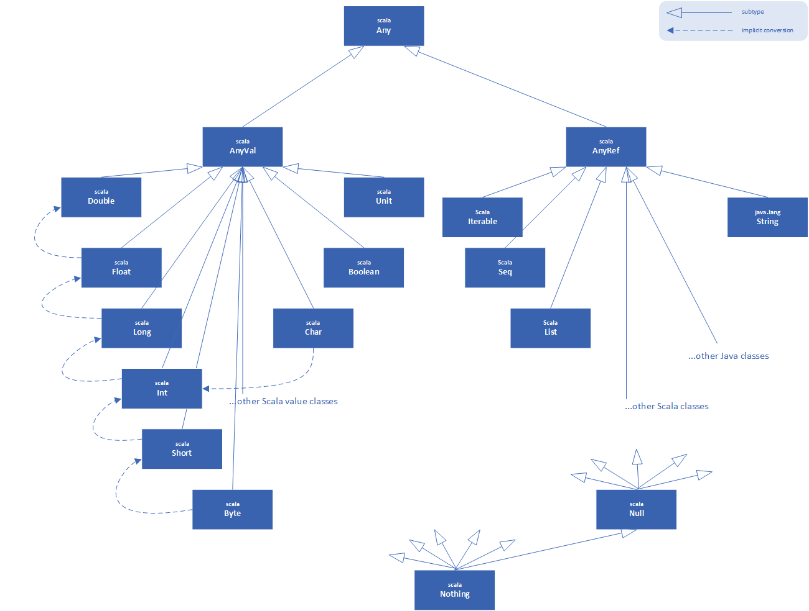

# Part 2 &mdash; Scala In Depth: Scala's Hierarchy
> Scala's class hierarchy.

---
+ Abstract classes and abstract methods
+ Basic Notions of Equality in Scala
+ Bottom Types: `Null` and `Nothing`
+ Constructing Custom Value Types
---

## Intro
In Scala, every class inherits from a common superclass named `Any`. Because every class is a subclass of `Any`, the methods defined in `Any` are *universal* methods available in any object.

Scala also defines some interesting classes at the bottom of the hierarchy: `Null` and `Nothing`, which essentially act as common subclasses. For example, just as `Any` is a superclass of every other class, `Nothing` is a subclass of every other class.

## Scala's Class Hierarchy
The following figure shows an outline of Scala's class hierarchy:



At the top of the hiearchy is the class `Any`, which defines the following methods:

```scala
final def ==(that: Any): Boolean
final def !=(that: Any): Boolean
def equals(that: Any): Boolean
def ##: Int
def hashCode: Int
def toString: String
```

Because every class inherits from `Any`, every object in a Scala program can be compared using `==`, `!=` or `equals`; hashed using `##` or `hashCode`; and formatted using `toString`.

Note that the equality and inequality methods are declared as `final`, and therefore, cannot be overridden in subclasses. The method `==` is essentially the same as `equals` and `!=` is the negation of `equals`. So, individual classes can tailor what `==` and `!=` means by overriding the `equals` method.

The root of the class has two subclasses: `AnyVal` and `AnyRef`. `AnyVal` is the parent class of all the value classes in Scala. While you can define your own value classes, there are nine value classes built into Scala: `Byte`, `Short`, `Char`, `Int`, `Long`, `Float`, `Double`, `Boolean` and `Unit`. The first eight of these correspond to Java's primitive types, and their values are represented at run time as Java's primitive values. The instances of these classes are all written as literals in Scala, and cannot be instantiated with `new`:

```scala
new Int // -> Err: class Int is abstract
```

This is achieved by defining all those value classes as abstract and final.

The other value class, `Unit` corresponds roughly to Java's `void` and it is used to tag methods and functions that do not return any interesting result. `Unit` has a single value instance denoted as `()`.

The value classes support the usual arithmetic and boolean opeators as methods.

All value classes are subtypes of `AnyVal` but they do not subclass each other. Instead, there are implicit conversions between different value class types: `Int` are automatically widened to `Long` when required.

Implicit conversions are also used to add more functionality to value types. For instance, see all the operations the type `Int` supports:

```scala
42 max 43 // -> 43
42 min 43 // -> 42
1 until 5 // -> Range(1, 2, 3, 4)
1 to 5    // -> Range(1, 2, 3, 4, 5)
(-3).abs     // -> 3
```

This works because there is class `scala.runtime.RichInt` that defines all those methods, and there is an *implicit* conversion from `Int` to `RichInt`. The conversion is applied whenever a method is invoked on an `Int` that is undefined there but defined in `RichInt`. The mechanisms for *implicit conversions* will be explained in other sections.

The other subclass of the root class `Any` is `AnyRef`. This is the base class of all reference classes in Scala. So, `AnyRef` is just an *alias* of `java.lang.Object` class.

## Basic Notions of Equality in Scala
In Scala, the equality operator (`==`) is designed to be transparent with respect to the type's representation. For value types, it is the numerical/boolean equality. For reference types, it is treated as an alias of the `equals` method inherited from `java.lang.Object`. Therefore, for reference classes, `equals` method is typically overridden to provide their natural notion of equality, so that you can do:

```scala
val x = 555
val y = 555

def isEqual(x: Any, y: Any): Boolean = x == y
isEqual(x, y) // => true, the equivalent in Java is false (upcasting to Object, then compare with `==`)

val a = "abcd".substring(2)
val b = "abcd".substring(2)
a == b // => true, the equivalent in Java would be false (you'd have to use `equals` to obtain true)
```

For the situations in which you'd want to do *reference equality* (Java's *==*), Scala offers the `eq` method, which cannot be overridden. Scala also provides `ne` as the negation of `eq`.

```scala
val s1 = new String("abc")
val s2 = new String("abc")

s1 == s2 // -> true
s1 eq s2 // -> false
s1 ne s2 // -> true

val x1 = "abc"
val x2 = "abc"

x1 == x2 // -> true
x1 eq x2 // -> true
x1 ne x2 // -> true
```

## Bottom Types
Scala's define the classes `scala.Null` and `scala.Nothing` to address some *corner cases* of Scala's object-oriented type system in an uniform way.

Class `Null` is the type of the *null reference*. It is a sucbclass of every reference class (i.e. every class that inherits from `AnyRef`). `Null` is not compatible with value types.

`Nothing` is at the very bottom of Scala's class hierarchy &mdash; it is a subtype of every other type. There exist not values of this type. It is used to signal an abnormal termination.

For example, the following method is defined in the `Predef` object of Scala's standard library:

```scala
def error(message: String): Nothing =
  throw new RuntimeException(message)
```

The return type `Nothing` tells the user that the method will not return normally. Because `Nothing` is a subtype of every other type, you can safely *throw exceptions* or invoke `error` in any type of function without changing the signature of the function:

```scala
def weirdFun(x: Int, y: Int): Int =
  if (y > 0) x / y
  else error("You cannot divide by zero")
```

## Defining your own Value Classes
Scala allows you to define your own value classes to augment the ones that are built in. Only certain classes can be made into value classes:
+ It must have exactly one parameter
+ It must have nothing inside it except `def`s
+ No other class can extend a value class
+ It cannot redefine `equals` or `hashCode`.

```scala
class Dollars(val amount: Int) extends AnyVal {
  override def toString: String = "$" + amount
}

val money = new Dollars(100) // -> money: Dollars = $1000
money.amount // -> 100
```

### Avoiding a Types Monoculture
Scala is very conducive to defining a new class for each domain concept, even when it woud be possible to reuse the same class for different purposes. Even if such a class is a so-called *tiny type* with no methods or fields, defining a new class is a way to help the compiler be helpful to you.


---
## You know you've mastered this chapter when...

+ You understand that all Scala's classes inherit from `Any`. You're also aware that `AnyVal` is a subclass of `Any` that is the root class for all Scala's value types, and `AnyRef` is another subclass of `Any` that is the root class for all the reference classes in Scala.
+ You understand the basic notions of equality in Scala:
  + `==` is the numeric/boolean equality for value types
  + `==` is an alias for the `equals` method, and therefore classes typically override `equals` so that `==` represent the natural notion of equality (e.g. in strings, the actual contents of the string)
  + `eq` (and `ne`) can be used in Scala to check for reference equality (and inequality).
+ You're aware that `Null` is used to model the type of the *null reference* and is not compatible with value types.
+ You know that `Nothing` is a subtype of every other type and it is used to signal an error to the user. 
+ You know how to build custom value types that extend from `AnyVal`, and are aware of the restrictions for such types.
+ You understand that Scala is very conducive to the creation of classes to describe each and every concept of a domain model, instead of reusing classes for different purposes.
---

## Projects

### [01 &mdash; Scala's class hierarchy](./01-scalas-hierarchy-worksheet)
IntelliJ worksheet project with several worksheet illustrating the concepts of the section.

### [02 &mdash; Tiny Types HTML SBT app](./02-tiny-types-html-app-sbt)
SBT project that illustrates how conducive Scala is to the creation of tiny types.