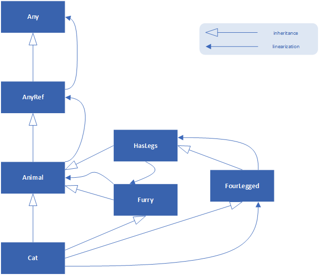

# Part 2 &mdash; Scala In Depth: Traits
> Scala's trait concept: fragments that can be combined into more complex concepts through trait mixin.

---
+ Basic Notions on Traits
+ Thin vs. Rich Interfaces in Scala
+ An enrichment trait implementation example: the `Rectangle` *trait*
+ The `Ordered[C]` trait
+ Traits as *stackable modifications*
+ Linearization of multiple traits and classes
+ Guidelines for using a trait vs. abstract class
---

## Intro
Traits are a fundamental unit of code reuse in Scala. A trait encapsulates method and field definitions, which can then be reused by mixing them into classes. Unlike class inheritance, in which a class must inherit from just one superclass, a class can mix any number of traits.

A trait is typically useful to widening thing interfaces to rich ones, and defining stackable modifications.

## How Traits work
A trait definition looks just like a class definitions, except that it uses the keyword `trait`:

```scala
trait Philosophical {
  def philosophize() = println("I consume memory, therefore I am")
}
```

This *trait* does not declare a superclass, and therefore it has the default superclass `AnyRef`. It defines a single concrete method.

Once a *trait* is defined, it can be mixed in into a class with the words `extends` or `with`:

```scala
class Frog extends Philosophical {
  override def toString = "green"
}
```

When you extend from a *trait* you implicitly inherit the trait's superclass. Methods inherited from a trait can be used like methods inherited from a superclass:

```scala
val frog = new Frog
frog.philosophize()
```

A trait also defines a type:

```scala
val phil: Philoshophical = frog
phil.philosophize()
```

The type of `phil` is `Philosophical`, a trait. Thus, variable `phil` could have been initialized with any object whose class mixes in `Philosophical`.

If you wish to mix a trait into a class that explicitly extends a superclass, you use extends to indicate the superclass and with to mix in the trait. If you want to mix in multiple traits, you add more with clauses.

For example:

```scala
class Animal
trait HasLegs

class Turtle extends Animal with Philoshophical with HasLegs {
  override def toString = "green shell"
}
```

A class with a mixed-in trait can override the methods inherited from a *trait*:

```scala
class Tortoise extends Animal with Philoshophical {
  override def toString: String = "green shell"
  override def philosophize(): Unit = println(s"It ain't easy having a ${toString}!")
}

val t = new Tortoise
t.philosophize()
```

*Traits*, beside featuring concrete methods, can also declare fields and maintain state. They are more akin to classes than they are to *Java interfaces*. 
However they are different from classes in the following points:
+ a *trait* cannot have any *class parameters* as in `class Point(x: Int, y: Int)`
+ calls to `super` in *traits* are dynamically bound (in classes those are statically bound). This happens because the actual method that will be called will be decided once the trait has been *mixed in* into a concrete class. This fact about `super` in *traits* is key to allowing traits to work as *stackable modifications*, as we will see.

## Thin vs. Rich Interfaces
One major use of traits is to automatically add methods to a class. That is, *traits* can enrich a *thin interface*, making it into a *rich interface*.

A *rich interface* has many methods, which is conveniento for the caller. A *thin interface, on the other hand, has fewer methods, and thus is easier on the implementers.

Adding a concrete method to a *trait* tilts the thin-rich trade-off heavily towards rich interfaces. Adding a concrete method to a trait is a one-time effort, instead of having to implement the method each time the interface is inherited as it happens with *Java interfaces*.

To enrich an interface using traits, simply define a trait with a small number of abstract methods (the thin part of the trait's interface) and add a large number of concrete methods, all implemented in terms of the abstract methods. Then, you can mix the enrichment trait into a class, implement the thin portion of the interface, and end up with a class that has all of the rich interface available.

## Example: Rectangular Objects
We are going to see how the use of traits simplify the burder of a library writer, while providing a rich interface to the library consumer.

To exemplify it, we will create a library for rectangular objects. To make these objects convenient to use, the libraries often provide geometric querires such as *width*, *height*, *left*, *right*, *topLeft*, etc.

First of all, let's see how it would look without traits:

```scala
class Point(val x: Int, val y: Int)

class Rectangle(val topLeft: Point, val bottomRight: Point) {
  def left = topLeft.x
  def right = bottomRight.x

  def width = right - left
  ...
}
```

The `Rectangle` class takes two pointsin its primary constructor that identify the top-left and bottom-right points. It then implements many convenience methods.

Another class might define a *2D graphical widget*:

```scala
abstract class Component {
  def topLeft: Point
  def bottomRight: Point

  def left = topLeft.x
  def right = bottomRight.x
  def width = right - left
  ...
}
```

Note how many of the definitions are exactly the same in the two classes. This can be eliminated by using an *enrichment trait*. The *trait* will have two abstract methods that return the top-left coordinate of the object, and another that returns the bottom-right coordinate. Then, it will provide many convenience methods based on those abstract methods:

```scala
trait Rectangular {
  // thin interface
  def topLeft: Point
  def bottomRight: Point

  // rich interface
  def left = topLeft.x
  def right = bottomRight.x
  def width = right - left
  ...
}
```

Then, both `Rectangle` and `Component` can mix in this trait to get all the geometric methods provided by `Rectangular`:

```scala
abstract class Component extends Rectangular {
  // other methods
}

class Rectangle(val topLeft: Point, val bottomRight: Point) extends Rectangular {
  // other methods
}
```

And then, you will be able to use both the thin interface (implemented by passing the two points in the primary constructor) and the rich interface (without having implemented anything):

```scala
class Point(val x: Int, val y: Int)

trait Rectangular {
  def topLeft: Point
  def bottomRight: Point
  
  def left: Int = topLeft.x
  def right: Int = bottomRight.x
  def width: Int = right - left
  
  def top: Int = topLeft.y
  def bottom: Int = bottomRight.y
  def height: Int = bottom - top
}

class Rectangle(val topLeft: Point, val bottomRight: Point) extends Rectangular

val rect = new Rectangle(new Point(1, 1), new Point(10, 10))
rect.left   // -> 1 
rect.right  // -> 10
rect.width  // -> 9
```

## The `Ordered` trait
Comparison is another domain where a rich interface is convenient. Whenever you compare two objects that are ordered, it is convenient if you use a single method call to ask about the precise comparison you want (that is, you would like to use the *<=* method rather than using `(x < y) || (x == y)`).

Without using traits, the implementation gets messy. Let's consider the `Rational` class example from a few sections ago:

```scala
class Rational(n: Int, d: Int) {
  ...
  def < (that: Rational) = this.numer * that.denom < that.numer * this.denom
  def > (that: Rational) = that < this
  def <= (that: Rational) = (this < that) || (this == that)
  def >= (that: Rational) = (this > that) || (this == that)
}
```

Note how this calls for an enrichment trait because `>`, `<=` and `>=` are defined in terms of the first one. Also note that many classes would benefit from such a *trait*, as the only method to be implemented in all use cases would be the *thin interface* method `<`.

This problem is so common that Scala provides a trait to help with it called `Ordered`. To use it, you replace all of the individual comparison methods with a single `compare` method. Then, `<`, `>`, `<=` and `>=` are defined by the trait in terms of the `compare` method.

In our example, this would mean:
```scala
class Rational(n: Int, d: Int) extends Ordered[Rational] {
  ...
  def compare(that: Rational) = (this.numer * that.denom) - (that.numer * this.denom)
}
```

| Note: Hello, type parameters! |
|-------------------------------|
| Unlike other traits and classes seen so far, `Ordered[C]` requires you to specify a *type parameter* when you mix it in. For now, you can think of it as if this trait makes you specify the type of parameters that will be ordered, for example `Ordered[Rational]` in our example |

So all that's required is to implement the `compare` method according to the following rules:
+ The method should compare the receiver (`this`) with the object passed as argument.
+ It should return an integer that is:
  + zero if both objects are the same.
  + negative if the receiver (`this`) is less than the argument.
  + positive if the receiver (`this`) is greater than the argument.

Now, we can use all the enrichment interface for comparisons in our `Rational` class:

```scala
val half = new Rational(1, 2)
val third = new Rational(1, 3)

half < third // -> false
half > third // -> true
```

Any time you implement a class that is ordered by some comparison, you should consider mixing in the `Ordered` trait. By doing so, you will provide the class's user with a rich set of comparison methods with very little effort on your side (just the implementation of `compare`!).

Beware that the `Ordered` trait does not define equals for you. The problem is that implementing `equals` in terms of `compare` requires checking the type of the passed object, and because of type erasure, `Ordered` itself cannot perform such a check. Thus, you need to define `equals` yourself, even if inherit `Ordered`.

The complete definition of `Ordered` is the following:
```scala
trait Ordered[T] {
  def compare(that: T): Int

  def <(that: T): Boolean = (this compare that) < 0
  def >(that: T): Boolean = (this compare that) > 0
  def <=(that: T): Boolean = (this compare that) <= 0
  def >=(that: T): Boolean = (this compare that) >= 0    
}
```

## Traits as *Stackable Modifications*
Apart from turning a thin interface into a rich one, traits are also usefult for providing stackable modifications to classes &mdash; traits lets you modify the methods of a class and they do so in a way that allows you to stack those modifications with each other.

As an example, we will consider stacking modifications to a queue of integers. The queue will have two operations: `put` (which will place integers into the queue) and `get` (which will take them back out in the order they were inserted).

Given that class, we can define traits to perform modifications such as these:
+ Doubling &mdash; double all the integers that are put into the queue
+ Incrementing &mdash; increment all integers that are put in the queue
+ Filtering &mdash; filter out negative integers from the queue

These traits represent *modifications* of the underlying queue behavior (we don't want to create full-fledged queues with those behaviors). Also, those three are *stackable* meaning that you can mix in several of theses to obtain a new class.

```scala
abstract class IntQueue {
  def get: Int
  def put(x: Int): Unit
}

import scala.collection.mutable.ArrayBuffer

class BasicIntQueue extends IntQueue {
  private val buf = new ArrayBuffer[Int]
  def get: Int = buf.remove(0)
  def put(x: Int) = buf += x
}

val queue = new BasicIntQueue
queue.put(10)
queue.put(20)

queue.get
queue.get
```

Now we have a basic implementation for the queue, and we're ready to tackle the modifications.

The first modification is `Doubling`, a trait that will double all of the elements placed into the queue. Note that the trait has to extend from `IntQueue` so that it can only be mixed in into classes that extend from `IntQueue`.

```scala
trait Doubling extends IntQueue {
  abstract override def put(x: Int) = super.put(2 * x)
}
```

Note also that the trait has an abstract method that features a `super` call, which would not be permitted for regular classes. For a trait, this call can actually succeed since `super` calls in a trait are dynamically bound. So as long as the trait is mixed in after another trait or class that gives a concrete definition to the method, it will work. 

This arrangement is frequently needed with traits that implement stackable modifications. To tell the compiler that you're doing this on purpose, you must mark the method as with `abstract override`. This combination is only allowed for members of traits, and means that the trait can only be mixed into some class that has a concrete implementation of the method in question.

In our case:
```scala
trait Doubling extends IntQueue {
  abstract override def put(x: Int): Unit = super.put(2 * x)
}

class MyDoublingQueue extends BasicIntQueue with Doubling

val myDoublingQueue = new MyDoublingQueue
myDoublingQueue.put(10)
myDoublingQueue.put(20)

myDoublingQueue.get // -> 20
myDoublingQueue.get // -> 40
```

Scala syntax even allows you to mix in the trait at the point of instantiating it:

```scala
val myQueue = new BasicIntQueue with Doubling
myQueue.put(50)
myQueue.put(100)
myQueue.get // -> 100
myQueue.get // -> 200
```

Now, the approach is straight forward for `Incrementing` and `Filtering` traits:

```scala
trait Incrementing extends IntQueue {
  abstract override def put(x: Int): Unit = super.put(x + 1)
}

trait Filtering extends IntQueue {
  abstract override def put(x: Int): Unit = if (x >= 0) super.put(x)
}

val q = (new BasicIntQueue with Incrementing with Filtering)
q.put(-1)  // NOOP
q.put(0)   
q.get     // 1
```

Note that the order of mixins is significant. Roughly speaking, traits further to the right take effect first, meaning that in the previous example, `Filtering` will be called before `Incrementing`.

## Linearization of multiple traits and classes
Traits are a way to inherit from multiple class-like constructs, but they differe in important ways from the multiple inheritance found in many languages.

With traits, the `super` call is determined by a linearization of the classes and traits that are mixed into the class (instead of determined right where the class appears).

Linearization makes that when you instantiate a class with `new`, Scala takes the class and all of its inherited classes and traits and puts them in a single, linear order. Then, whenever you call `super` inside one of those classes, the invoke methid is the next one up the chain. If all of the method but the last call to `super`, the net result is the *stackable* behavior we saw in the previous section.

The precise order of linearizations is described in the language specification, and it is complicated, but the main thing to understand is that when you write a method that calls `super`, that method is definitely modifying the behavior of the superclass and mixed in traits, not the other way around.

### Details of Scala linearization
Consider the following example, involving a class `Cat`, which inherits from `Animal` and two *supertraits* `Furry` and `FourLegged`. The latter also inherits from another trait `HasLegs`:


```scala
class Animal
trait Furry extends Animal
trait HasLegs extends Animal
trait FourLegged extends HasLegs
class Cat extends Animal with Furry with FourLegged
```

The following diagram depicts the class diagram using the regular UML notation, with the darkened arrows depicting linearization &mdash; that is, pointing in the direction in which `super` calls will be resolved.



The linearization of `Cat` is computed from back to front as follows. The last part of the linearization of `Cat` is the linearization of its superclass, `Animal`. The linearization is copied over without any changes. Because `Animal` doesn't extend a superclass or mix in any super traits, it by default extends `AnyRef`, which extends `Any`.

```
Animal -> AnyRef -> Any
```

The next part is the linearization of the first mixin, trait `Furry`, but all classes that are already in the linearization of `Animal` are left out now, so that each class appears only once in `Cat`'s linearization.

```
Furry -> Animal -> AnyRef -> Any
```

This is preceded by the linearization of `FourLegged`, where again any classes that have already been copied in the linearization of the superclass or the mixin are left out:

```
FourLegged -> HasLegs -> Furry -> Animal -> AnyRef -> Any
```

Note that the `Furry -> Animal -> AnyRef -> Any` comes from the prev step.

Finally, the first class in the linearization of `Cat`is `Cat` itself:

```
Cat -> FourLegged -> HasLegs -> Furry -> Animal -> AnyRef -> Any
```

When any of these classes and traits invokes a method via `super`, the implementation invoked will be the first implementation to its right in the linearization.

## To Trait or Not To Trait
This section gives you the guidelines about when to define a *trait* and when to use an *abstract class*. 

+ If the behavior will not be reused, then make it a concrete class.
+ If it might be reused in multiple, unrelated classes, make it a *trait*. Only traits can be *mixed into* different parts of the class hierarchy.
+ If you want to inherit from it in Java code, use an *abstract class*. Since *traits with code* does not have a close analog in Java, it tends to be awkward to do that.
+ If you plan to distribute it in compiled form, and you expect outside groups to write classes inheriting from it, you might lean towards using an abstract class.

---
## You know you've mastered this chapter when...

+ You understand the basics of *traits*: a construct that encapsulates methods and fields and that can be mixed into concrete classes with the keyword `extends` and `with`. You understand that *traits* are more akin to classes than *Java interfaces* except for a couple of restrictions (class parameters, and the dynamic binding of `super` in traits). You understand that methods in a trait can be overriden just like methods in regular classes you inherit.
+ You're aware that traits tilt the thin vs. rich interface discussion to rich interfaces. The trick is to define traits with a small number of abstract methods (the thin portion of the interface), and then define a large number of concrete methods based on the abstract methods (the rich portion of the interfaces). Thus, implementers should only write the definition of the small number of abstract methods and clients will be able to use the large number of concrete methods available.
+ You're comfortable mixing in the `Ordered[C]` trait in your classes. You understand that with very little effort (the implemetnation of a single `compare` method) the class user will get a rich interface with the methods `<`, `>`, `<=` and `>=`. You understand that `Ordered` does not provide `equals`.
+ You understand the concept of *stackable modifications* &mdash; traits that modify the behavior of an existing class when mixed in. You're comfortable writing these traits and understand that you typically have to use `abstract override` when defining the methods in these traits. 
+ You're aware that Scala lets you mix in traits when a class is being instantiated (e.g. `new BasicIntQueue with Filtering`)
+ You understand that linearization is the way in which Scala places the order of calls in a single line to be able to resolve the calls to `super` when a class and multiple traits are used. You know how to calculate the linearization yourself, and you know that the method invoved (when using `super`) will be the first implementation to its right in the linearization.
---


## Projects

### [01 &mdash;Traits](./01-traits-worksheet)
IntelliJ worksheet project with several worksheet illustrating the concepts of the section.

### [02 &mdash; Tiny Types HTML SBT app](./02-tiny-types-html-app-sbt)
SBT project that illustrates how conducive Scala is to the creation of tiny types.